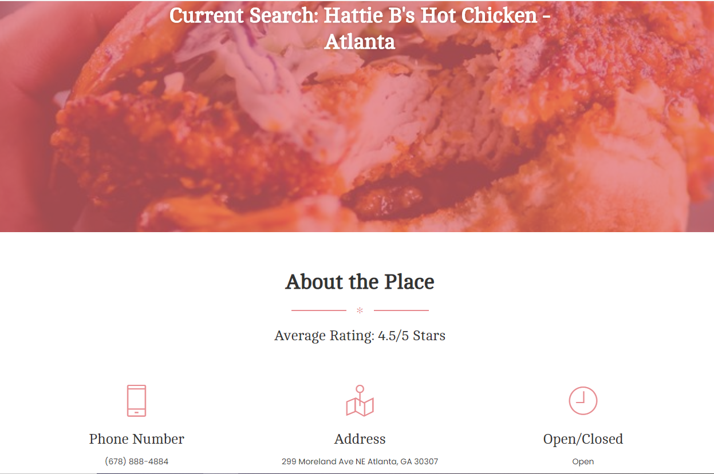
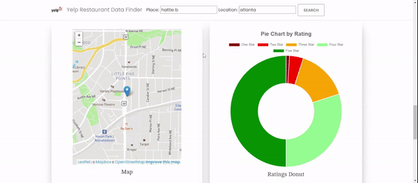

# Yelp Restaurant Aggregator and Analysis

## Objectives:
The objective of this project is to create a user friendly website that will present information valuable to them about how positively or negatively reviewed the location is. Using machine learning sentiment analysis, our team wanted to distinguish common words that would appear in positive reviews as well as for negative reviews. For example, if a restaurant's positive reviews mentioned a dish often, it could mean that the user should consider ordering that dish. Vise versa, if a restaurant's negative reviews mentioned "wait" often, it could mean that the user should consider a different location as there might be a long wait time.

## Summary:
We used a combination of data from Kaggle, a Yelp API, and a webscraper we had built in order to build our finished product.  

The Kaggle dataset allowed us to build and train a 93% accurate Machine Learning model, utilizing the multionomial naive bayes classifer based off of 25,000 randomly selected reviews. The model allowed us to categorize reviews as either positive or negative, with the former camp being categorized by 1 and 2 star versus 4 and 5 on the latter, which we then parsed through to create a bag of words.  This bag of words was binned and fed through Flask into the Anychart.js library, which visualizes a positive or negative cloud accordingly to highlight a restaurant's strengths and weaknesses.  We also binned star ratings from the scrape, which we used to create an interactive doughnut chart analysis in Chart.js.

The Yelp API was useful, albeit a little limited, and provided us with restaurant information such as location, whether or not they are open, and a phone number.  Additionally, we were able to pull coordinate information that we fed into Leafleat.js to create a map, which serves as  visual guide to help the end user plan their schedule around location.

## Methods Used:
- Machine Learning (Sentiment Analysis)
- API Calling
- Webscraping (Beautiful Soup)
- Data Visualizations

## Technologies:
- Python (Pandas, Jupyter)
- HTML/CSS/Bootstrap (Creative Tim Template)
- JavaScript
- Flask
- D3, ChartsJS, Leaflet
- Beautiful Soup

## Instructions:
To begin, run our app.py file to initilaize a local server environment in which to run our Yelp Aggregator.  Make sure to have all the dependencies installed, which can be done by doing pip install *package*. To view and interact with the app you must type localhost:5000 into Google Chrome. The webscraper in our application relies on chromedriver to properly function, thus we would have to add additional drivers to expand functionality with other major browsers.  Once these conditions have been met, using our aggregator app is a simple process.

First, input a restaurant name and location into the text boxes at the top of the webpage.  Keep in mind that although the Yelp API has an autocomplete function in place, the query can be temperamental when handling extra spaces, characters, or if there are little to no reviews in place.

Once you are satisfied with your query criteria, click on the search button and wait patiently for the preloader gif to disappear. At this point the Yelp API call has completed and populated the restaurant information, top reviews, and the map.

At this point, wait patiently as the webscrape takes a little bit of time to pull in to populate our doughnut analysis and wordcloud analyses. The amount of pages used to scrape the reviews can be changed in the scrape.py file. Both the doughnut chart as well as the word clouds are interactive.

## Conclusion:
Overall, we found our application to be very useful in incorporating data and machine learning to give a more insightful overview of restaurants search.  We sharpened our skillset and grew our expertise with the various languages and libraries we utilized, and gained a better understanding of framework and limitations. As the Yelp API didn't contain all of the reviews, we had to rely on webscraping to gather that information which brought its own challenges, namely increasing load times and consistency issues. Despite the limitations with gathering data, the end product is still a simple yet effective Yelp Aggregator that will greatly benefit any user, whether they be an investor or consumer.
